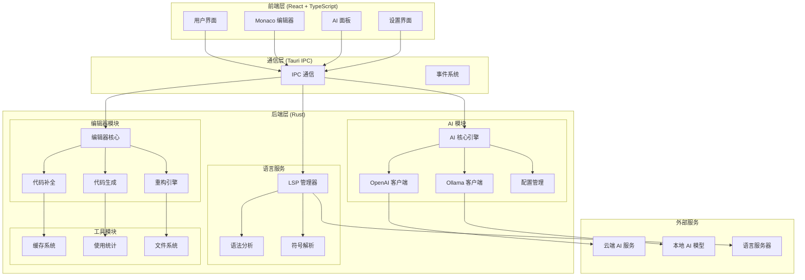
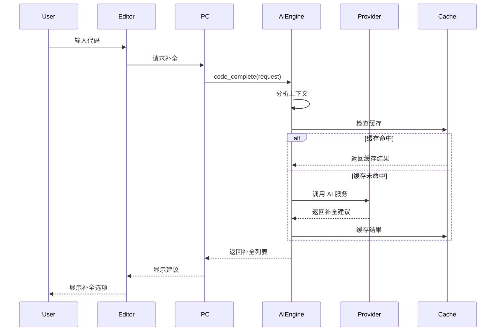
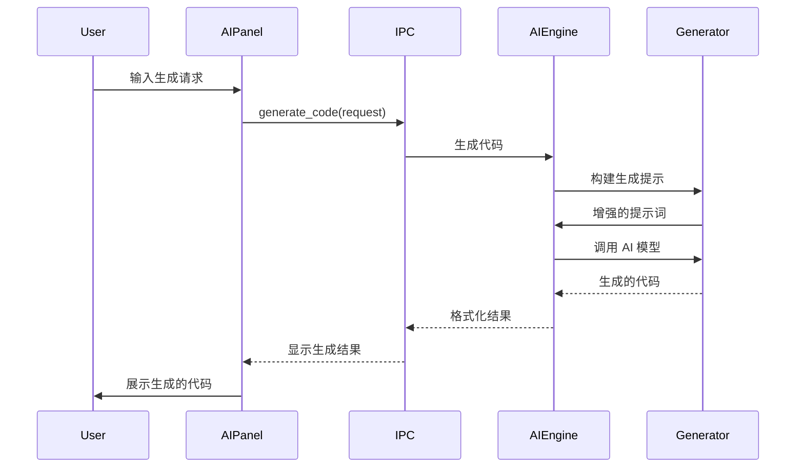

# GoPilot 技术架构文档

## 🏗️ 整体架构



## 🧩 核心模块详解

### 1. AI 模块架构

```rust
// src-tauri/src/ai/mod.rs
pub mod engine;
pub mod providers;
pub mod completion;
pub mod generation;
pub mod context;

pub use engine::AIEngine;
pub use providers::{AIProvider, AIConfig};
pub use completion::CodeCompletion;
pub use generation::CodeGenerator;
pub use context::CodeContext;
```

#### AI 引擎设计
```rust
// src-tauri/src/ai/engine.rs
pub struct AIEngine {
    provider: Box<dyn AIProvider>,
    context_analyzer: ContextAnalyzer,
    cache: CompletionCache,
}

impl AIEngine {
    pub async fn complete_code(&self, request: CompletionRequest) -> Result<Vec<Completion>, AIError> {
        // 1. 分析上下文
        let context = self.context_analyzer.analyze(request.clone()).await?;
        
        // 2. 检查缓存
        if let Some(cached) = self.cache.get(&context.hash()).await {
            return Ok(cached);
        }
        
        // 3. 调用 AI 服务
        let completions = self.provider.complete_code(context).await?;
        
        // 4. 缓存结果
        self.cache.set(context.hash(), completions.clone()).await;
        
        Ok(completions)
    }
}
```

### 2. 编辑器集成

#### Monaco Editor 集成
```typescript
// src/components/editor/MonacoEditor.tsx
import * as monaco from 'monaco-editor';
import { invoke } from '@tauri-apps/api/tauri';

export const MonacoEditor: React.FC = () => {
  const editorRef = useRef<monaco.editor.IStandaloneCodeEditor>();
  
  const setupAICompletion = (editor: monaco.editor.IStandaloneCodeEditor) => {
    monaco.languages.registerCompletionItemProvider('typescript', {
      provideCompletionItems: async (model, position) => {
        const request = {
          filePath: model.uri.path,
          content: model.getValue(),
          position: { line: position.lineNumber, column: position.column },
          language: model.getLanguageId()
        };
        
        const completions = await invoke<Vec<Completion>>('code_complete', request);
        return { suggestions: completions.map(toMonacoSuggestion) };
      }
    });
  };
  
  return (
    <div ref={editorContainer} />
  );
};
```

### 3. LSP 集成架构

```rust
// src-tauri/src/lsp/mod.rs
pub struct LSPManager {
    clients: HashMap<String, LSPClient>,
    workspace: WorkspaceRoot,
    message_sender: UnboundedSender<LSPMessage>,
}

impl LSPManager {
    pub async fn initialize(&mut self, language: String) -> Result<(), LSPError> {
        let server = self.start_language_server(language).await?;
        let client = LSPClient::new(server, self.message_sender.clone());
        
        let init_params = InitializeParams {
            process_id: Some(std::process::id()),
            root_uri: Some(self.workspace.to_url()),
            capabilities: ClientCapabilities::default(),
            ..Default::default()
        };
        
        client.initialize(init_params).await?;
        self.clients.insert(language, client);
        
        Ok(())
    }
    
    pub async fn get_completions(&self, language: String, params: CompletionParams) -> Result<Vec<CompletionItem>, LSPError> {
        let client = self.clients.get(&language)
            .ok_or(LSPError::ClientNotFound)?;
            
        client.completion(params).await
    }
}
```

## 🔄 数据流设计

### 代码补全流程



### 代码生成流程



## 🗄️ 数据模型

### 核心数据结构

```rust
// src-tauri/src/types.rs
#[derive(Debug, Clone, Serialize, Deserialize)]
pub struct CompletionRequest {
    pub file_path: PathBuf,
    pub content: String,
    pub cursor_position: Position,
    pub language: String,
    pub context: Option<CodeContext>,
}

#[derive(Debug, Clone, Serialize, Deserialize)]
pub struct Completion {
    pub id: String,
    pub text: String,
    pub display_text: String,
    pub insert_text: String,
    pub kind: CompletionKind,
    pub documentation: Option<String>,
    pub priority: i32,
}

#[derive(Debug, Clone, Serialize, Deserialize)]
pub struct CodeContext {
    pub file_path: PathBuf,
    pub language: String,
    pub imports: Vec<String>,
    pub functions: Vec<FunctionInfo>,
    pub classes: Vec<ClassInfo>,
    pub variables: Vec<VariableInfo>,
    pub surrounding_code: String,
    pub cursor_context: CursorContext,
}

#[derive(Debug, Clone, Serialize, Deserialize)]
pub struct GenerationRequest {
    pub prompt: String,
    pub language: String,
    pub context: Option<CodeContext>,
    pub style: CodeStyle,
    pub constraints: Vec<GenerationConstraint>,
}

#[derive(Debug, Clone, Serialize, Deserialize)]
pub struct GeneratedCode {
    pub code: String,
    pub explanation: Option<String>,
    pub confidence: f32,
    pub suggestions: Vec<String>,
}
```

## ⚡ 性能优化策略

### 1. 缓存系统

```rust
// src-tauri/src/cache/mod.rs
pub struct CompletionCache {
    lru_cache: Arc<Mutex<LruCache<String, CacheEntry>>>,
    redis_client: Option<redis::Client>,
    ttl: Duration,
}

#[derive(Debug, Clone)]
struct CacheEntry {
    completions: Vec<Completion>,
    timestamp: SystemTime,
    hit_count: u32,
}

impl CompletionCache {
    pub async fn get(&self, key: &str) -> Option<Vec<Completion>> {
        // 1. 检查内存缓存
        if let Some(entry) = self.lru_cache.lock().await.get(key) {
            if entry.timestamp.elapsed() < self.ttl {
                return Some(entry.completions.clone());
            }
        }
        
        // 2. 检查 Redis 缓存（如果可用）
        if let Some(redis) = &self.redis_client {
            if let Ok(cached) = redis.get::<_, String>(key).await {
                if let Ok(completions) = serde_json::from_str(&cached) {
                    // 更新内存缓存
                    self.lru_cache.lock().await.put(key.to_string(), CacheEntry {
                        completions: completions.clone(),
                        timestamp: SystemTime::now(),
                        hit_count: 1,
                    });
                    return Some(completions);
                }
            }
        }
        
        None
    }
}
```

### 2. 异步请求处理

```rust
// src-tauri/src/async_handler.rs
pub struct AsyncRequestHandler {
    request_queue: Arc<Mutex<VecDeque<PendingRequest>>>,
    worker_pool: ThreadPool,
    rate_limiter: RateLimiter,
}

impl AsyncRequestHandler {
    pub async fn submit_request(&self, request: AIRequest) -> Result<RequestId, HandlerError> {
        // 1. 检查速率限制
        self.rate_limiter.acquire().await?;
        
        // 2. 添加到队列
        let request_id = RequestId::new();
        let pending = PendingRequest::new(request_id, request);
        
        self.request_queue.lock().await.push_back(pending);
        
        // 3. 触发工作线程
        self.process_queue().await;
        
        Ok(request_id)
    }
    
    async fn process_queue(&self) {
        let queue = self.request_queue.clone();
        let pool = self.worker_pool.clone();
        
        tokio::spawn(async move {
            while let Some(pending) = queue.lock().await.pop_front() {
                let request = pending.request.clone();
                let sender = pending.sender.clone();
                
                pool.spawn(async move {
                    let result = self.handle_request(request).await;
                    let _ = sender.send(result);
                });
            }
        });
    }
}
```

### 3. 内存管理

```rust
// src-tauri/src/memory_manager.rs
pub struct MemoryManager {
    max_memory: usize,
    current_usage: Arc<AtomicUsize>,
    cleanup_threshold: f64,
}

impl MemoryManager {
    pub fn check_memory(&self) -> bool {
        let current = self.current_usage.load(Ordering::Relaxed);
        let threshold = (self.max_memory as f64 * self.cleanup_threshold) as usize;
        
        if current > threshold {
            self.trigger_cleanup().await;
        }
        
        current < self.max_memory
    }
    
    async fn trigger_cleanup(&self) {
        // 1. 清理过期缓存
        cache::cleanup_expired().await;
        
        // 2. 清理空闲连接
        lsp::cleanup_idle_clients().await;
        
        // 3. 强制垃圾回收
        tokio::task::spawn_blocking(|| {
            std::mem::drop(force_garbage_collection());
        }).await;
    }
}
```

## 🔒 安全架构

### 1. 数据隐私保护

```rust
// src-tauri/src/privacy/mod.rs
pub struct PrivacyManager {
    sensitive_patterns: Vec<Regex>,
    anonymizer: DataAnonymizer,
    encryption_key: Vec<u8>,
}

impl PrivacyManager {
    pub fn sanitize_code(&self, code: &str) -> Result<String, PrivacyError> {
        let mut sanitized = code.to_string();
        
        // 1. 检测敏感信息
        for pattern in &self.sensitive_patterns {
            sanitized = pattern.replace_all(&sanitized, "***REDACTED***").to_string();
        }
        
        // 2. 匿名化标识符
        sanitized = self.anonymizer.anonymize(&sanitized)?;
        
        // 3. 加密传输（如果需要）
        if self.should_encrypt() {
            sanitized = self.encrypt(&sanitized)?;
        }
        
        Ok(sanitized)
    }
}
```

### 2. 访问控制

```rust
// src-tauri/src/auth/mod.rs
pub struct AuthManager {
    api_keys: HashMap<String, ApiKeyInfo>,
    rate_limits: HashMap<String, RateLimit>,
    permissions: HashMap<String, Vec<Permission>>,
}

impl AuthManager {
    pub fn validate_request(&self, request: &APIRequest) -> Result<AuthContext, AuthError> {
        let api_key = request.headers.get("X-API-Key")
            .ok_or(AuthError::MissingApiKey)?;
            
        let key_info = self.api_keys.get(api_key)
            .ok_or(AuthError::InvalidApiKey)?;
            
        // 检查权限
        if !self.has_permission(&key_info.user_id, &request.permission) {
            return Err(AuthError::InsufficientPermissions);
        }
        
        // 检查速率限制
        if !self.rate_limits.get(api_key).unwrap().check() {
            return Err(AuthError::RateLimitExceeded);
        }
        
        Ok(AuthContext {
            user_id: key_info.user_id.clone(),
            permissions: self.permissions[&key_info.user_id].clone(),
        })
    }
}
```

## 🧪 测试架构

### 1. 单元测试框架

```rust
// src-tauri/src/testing/mod.rs
pub struct TestSuite {
    ai_tests: Vec<Box<dyn AITest>>,
    editor_tests: Vec<Box<dyn EditorTest>>,
    integration_tests: Vec<Box<dyn IntegrationTest>>,
}

#[async_trait]
pub trait AITest {
    async fn run(&self) -> TestResult;
    fn name(&self) -> &str;
}

pub struct CompletionTest {
    test_cases: Vec<CompletionTestCase>,
}

impl AITest for CompletionTest {
    async fn run(&self) -> TestResult {
        let mut results = Vec::new();
        
        for case in &self.test_cases {
            let completions = code_complete(case.request.clone()).await?;
            let passed = self.validate_completion(&completions, &case.expected);
            results.push(TestResultItem {
                name: case.name.clone(),
                passed,
                details: format!("Got {} completions", completions.len()),
            });
        }
        
        TestResult::new("completion_test", results)
    }
}
```

### 2. 性能测试

```rust
// src-tauri/src/benchmarks/mod.rs
pub struct BenchmarkSuite {
    completion_benchmark: CompletionBenchmark,
    generation_benchmark: GenerationBenchmark,
    memory_benchmark: MemoryBenchmark,
}

pub struct CompletionBenchmark {
    test_cases: Vec<BenchmarkCase>,
    metrics_collector: MetricsCollector,
}

impl CompletionBenchmark {
    pub async fn run(&self) -> BenchmarkResult {
        let mut results = Vec::new();
        
        for case in &self.test_cases {
            let start = Instant::now();
            
            let completions = code_complete(case.request.clone()).await.unwrap();
            
            let duration = start.elapsed();
            let memory_usage = self.metrics_collector.get_memory_usage();
            
            results.push(BenchmarkMetric {
                name: case.name.clone(),
                duration,
                memory_usage,
                success_rate: self.calculate_success_rate(&completions),
            });
        }
        
        BenchmarkResult::new("completion_benchmark", results)
    }
}
```

## 📊 监控与指标

### 1. 性能监控

```rust
// src-tauri/src/monitoring/mod.rs
pub struct MonitoringSystem {
    metrics_collector: MetricsCollector,
    alert_manager: AlertManager,
    dashboard: MonitoringDashboard,
}

pub struct MetricsCollector {
    request_count: AtomicU64,
    response_time: MovingAverage,
    error_rate: AtomicU64,
    memory_usage: AtomicUsize,
    cpu_usage: AtomicU64,
}

impl MetricsCollector {
    pub fn record_request(&self, duration: Duration, success: bool) {
        self.request_count.fetch_add(1, Ordering::Relaxed);
        self.response_time.add(duration.as_millis() as f64);
        
        if !success {
            self.error_rate.fetch_add(1, Ordering::Relaxed);
        }
    }
    
    pub fn get_metrics(&self) -> SystemMetrics {
        SystemMetrics {
            requests_per_second: self.calculate_rps(),
            average_response_time: self.response_time.average(),
            error_rate: self.calculate_error_rate(),
            memory_usage: self.memory_usage.load(Ordering::Relaxed),
            cpu_usage: self.cpu_usage.load(Ordering::Relaxed),
        }
    }
}
```

### 2. 错误追踪

```rust
// src-tauri/src/error_tracking/mod.rs
pub struct ErrorTracker {
    error_store: Arc<Mutex<VecDeque<ErrorEntry>>>,
    alert_threshold: usize,
}

#[derive(Debug, Clone)]
pub struct ErrorEntry {
    pub timestamp: SystemTime,
    pub error_type: String,
    pub message: String,
    pub context: serde_json::Value,
    pub stack_trace: Option<String>,
}

impl ErrorTracker {
    pub fn record_error(&self, error: &dyn std::error::Error, context: serde_json::Value) {
        let entry = ErrorEntry {
            timestamp: SystemTime::now(),
            error_type: error.to_string(),
            message: error.to_string(),
            context,
            stack_trace: Some(backtrace::Backtrace::new().to_string()),
        };
        
        self.error_store.lock().unwrap().push_back(entry);
        
        // 检查是否需要告警
        if self.error_store.lock().unwrap().len() > self.alert_threshold {
            self.trigger_alert().await;
        }
    }
}
```

---

*这个技术架构文档为 GoPilot AI 编码助手提供了详细的技术实现指导，涵盖了从基础架构到高级优化的各个方面。*
